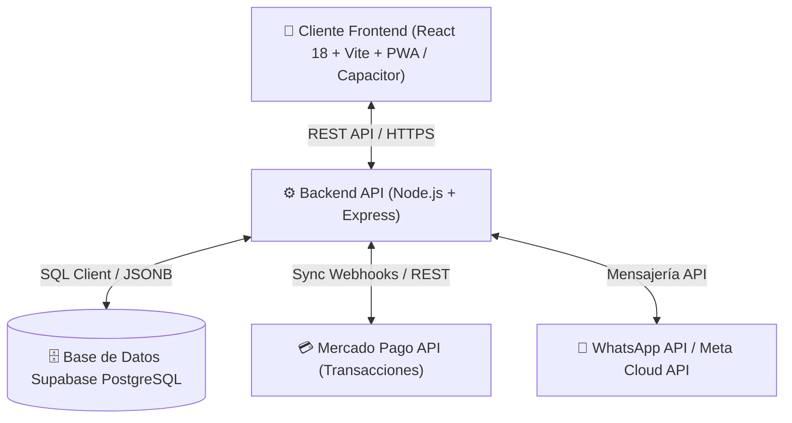

# 🥋 RANAS JIU JITSU — MANUAL Y DOCUMENTACIÓN TÉCNICA DE LA PLATAFORMA

## 📌 1. Visión General del Sistema
La plataforma de **Ranas Jiu Jitsu** es una aplicación web y móvil (PWA / Android / iOS) diseñada para la gestión integral de academias de Jiu Jitsu Brasileño. Permite controlar alumnos, cobros automatizados, asistencia a clases, comunicación directa por correo/WhatsApp y categorizaciones oficiales de competición bajo estándares IBJJF.

---

## 🚀 2. Módulos Funcionales

### 👤 2.1. Gestión de Alumnos y Perfiles
- **Ficha Técnica Individual**: Nombre, correo, teléfono, fecha de nacimiento y rut.
- **Grados y Cinturones**: Control de graduación (Blanco, Azul, Morado, Marrón, Negro, Gris) con barra de progreso de asistencias a la siguiente graduación.
- **Fotografía de Perfil con Recortador Integrado**: Subida de avatar en alta resolución con zoom y ajuste de encuadre circular.

### 🏆 2.2. Categorización Oficial IBJJF (Modalidad Gi)
- **Cálculo Automatizado**: El sistema determina en tiempo real la categoría exacta de competición según:
  1. **Edad / Fecha de nacimiento**: Juvenil, Adulto (18-29), Master 1-7.
  2. **Peso con Kimono (kg)**: División oficial (*Galo, Pluma, Pena, Leve, Médio, Meio-Pesado, Pesado, Super Pesado, Pesadíssimo*).
  3. **Género**: Masculino / Femenino (sin pre-selección por defecto).
  4. **Cinturón**.
- **Visualización Limpia**: Tarjetas estilizadas en el perfil del alumno y en la ficha del administrador.

### 💳 2.3. Control de Recaudación y Mensualidades (Mercado Pago & Manual)
- **Sincronización Automática de Transferencias**: Escaneo inteligente de pagos recibidos vía Mercado Pago, asociando automáticamente los pagos con los alumnos por RUT, email o ID.
- **Cobro Inteligente de Comisión**: Cálculo transparente del recargo de pasarela para garantizar que el dojo reciba la mensualidad neta contratada.
- **Registro Manual**: Opción para que el administrador registre pagos en efectivo o transferencias directas con fecha personalizada.
- **Alertas de Morosidad**: Cambio automático de estado a *Pendiente* si transcurren más de 28 días sin pago.

### 📅 2.4. Control de Asistencias y Agenda Semanal
- **Reserva de Clases**: Horarios semanales para adultos y niños.
- **Control de Cupos y Límites**: Bloqueo automático si el alumno excede el número de días contratados en su plan (ej: 2 días, 3 días, Ilimitado).

### 💬 2.5. Comunicaciones e Integración WhatsApp API
- **Bienvenida Automática por Email**: Envío de credenciales y datos de acceso al registrar un nuevo alumno mediante SMTP.
- **Integración WhatsApp API**:
  - Endpoint de envío directo (`/api/whatsapp/send`).
  - Variables dinámicas personalizables (`{nombre}`, `{monto}`, `{categoria}`, `{dojo}`, `{link_pago}`).
  - Formato internacional con código de país para Chile (+569).
  - Modo simulación / API oficial con 1-clic.

---

## 🛠️ 3. Arquitectura Técnica y Tecnologías



- **Frontend**: React 18, Vite, CSS Vanilla estilizado (Design System con variables HSL), Framer Motion, Lucide Icons.
- **Backend**: Node.js, Express, Nodemailer.
- **Base de Datos**: Supabase PostgreSQL DB (estructuras relacionales híbridas + columnas JSONB para persistencia resiliente).
- **Despliegue**: Render / Vercel para servicios API y cliente PWA.

---

## 📲 4. Guía de Configuración e Integración WhatsApp API

### Variables en `.env`:
```env
WHATSAPP_API_TOKEN=Tu_Token_Meta_Cloud_API
WHATSAPP_PHONE_NUMBER_ID=Tu_Phone_ID
WHATSAPP_API_URL=https://graph.facebook.com/v18.0
WHATSAPP_DEFAULT_PHONE=56939601560
```

### Probar Envío Vía API:
```bash
curl -X POST http://localhost:3002/api/whatsapp/send \
  -H "Content-Type: application/json" \
  -d '{
    "phone": "939601560",
    "studentName": "Nombre Alumno",
    "amount": 40000,
    "category": "Adulto - Leve (≤ 76 kg)",
    "message": "Hola {nombre}, tu categoría IBJJF es {categoria}. Mensualidad: {monto}."
  }'
```

---

## 🛡️ 5. Seguridad y Persistencia
- Datos sensibles enmascarados y almacenamiento cifrado en Supabase.
- Sincronización automática de estado de usuario sin pérdida de sesiones.
- Verificación estricta de términos y condiciones antes de permitir ingreso al portal.
